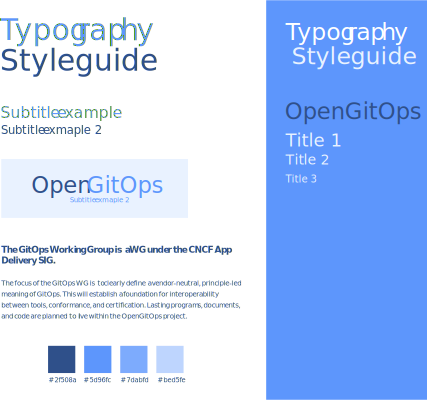

# OpenGitOps Branding

Here you'll find logo assets and a brand styleguide for the OpenGitOps project.

Logo creation discussion and consensus : [Github discussion](https://github.com/gitops-working-group/gitops-working-group/discussions/63)

## Logo

## Source Files

The branding was created in [Adobe Illustrator](https://www.adobe.com/fr/products/illustrator.html), [source files](../src/) are created in the vector `.ai` format.

## Styleguide

The project typography uses the [Lato](https://fonts.google.com/specimen/Lato) typeface created by Łukasz Dziedzic, which is made available under the Open Font License

The colors should be used sparingly for clean layouts. Here are some example uses // TODO

---

Any questions ? Looking for additional assets? Contact [iboonox](https://github.com/iboonox/).